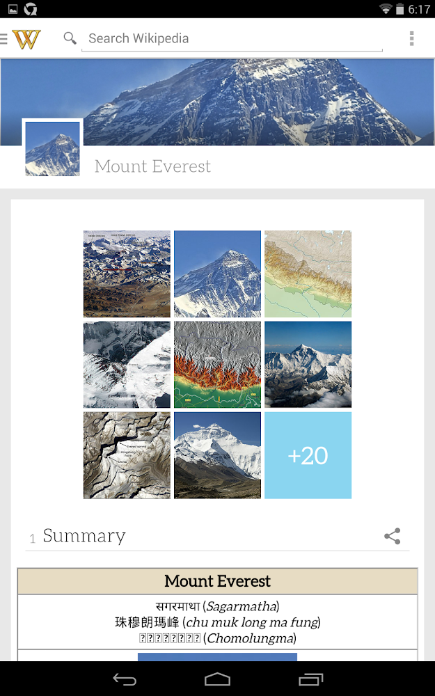
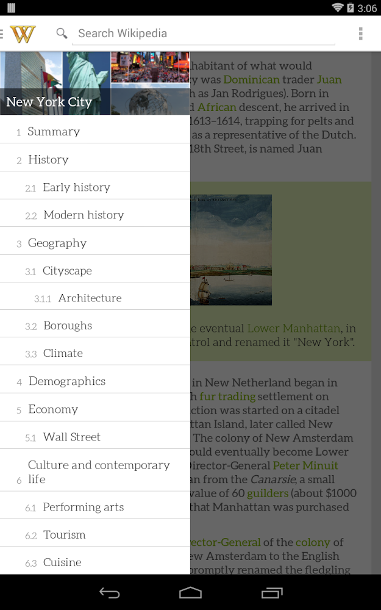

# Pocket Wikipedia

## About

Lightweight Wikipedia application for browsing and discovering Wikipedia content. Pocket Wikipedia is one of the few Wikipedia applications available for android that boasts a native content implementation - instead of simply launching the mobile Wikipedia website.

6/8/2018: This project is not maintained and targets a very old sdk (19). The above was true back in the day - the original Wikipedia Android application was merely a webview wrapper. 

## Features

* Auto-complete/suggest while searching
* Main page landing (updated daily)
* Article Navigation Drawer
* Image Gallery
